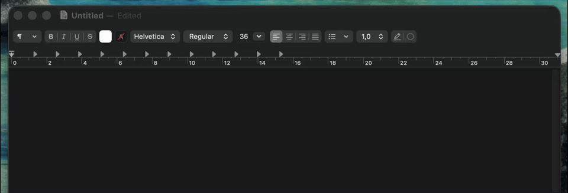

# FastWord

Local, private, push-to-talk dictation for macOS — powered by `whisper.cpp` running entirely on-device.

Hold a hotkey, speak, release — your words appear in any focused text field. Nothing leaves your Mac.



## Why

Wispr Flow / Superwhisper / Aiko are great, but they ship audio off your machine, charge a subscription, or both. FastWord is:

- **100% local.** Audio never leaves your Mac. No cloud, no telemetry, no account.
- **Tiny.** ~520 MB DMG (Whisper turbo Q5 model included). No background download on first launch.
- **Fast.** Native Swift app + native Rust sidecar around `whisper.cpp` with Metal acceleration on Apple Silicon. Sub-second end-to-end.
- **Light when idle.** The sidecar evicts the model from RAM after configurable idle time (default 10 min). Your MacBook keeps its memory.
- **Hackable.** Sidecar architecture means you can swap in a different ggml model without touching the Swift app.
- **Open source, MIT.**

### RAM footprint vs Wispr Flow

Measured on the same MacBook (Apple Silicon, macOS 26), both apps installed:

| State                  | Wispr Flow      | FastWord (v0.2)  |
| ---------------------- | --------------- | ---------------- |
| Idle (not dictating)   | **~800 MB**     | **~125 MB**      |
| Active (transcribing)  | ~1 GB           | ~750 MB          |
| After idle eviction    | ~800 MB         | **~125 MB again** |
| Architecture           | Electron + cloud transcription | Native Swift + Rust + whisper.cpp |
| Pricing                | $144/year       | Free, MIT         |

Wispr Flow keeps ~800 MB resident even when you're not dictating because Electron + background JavaScript processes never sleep. FastWord drops the model from RAM after the configured idle window, so you only pay the memory cost while you're actually using it. ([Wispr Flow idle RAM is widely reported on Reddit and review sites.](https://www.getvoibe.com/resources/wispr-flow-review/))

## Requirements

- **macOS 13 (Ventura) or later.** Apple Silicon (M-series).
- For development from source:
  - [Homebrew](https://brew.sh)
  - Xcode Command Line Tools (`xcode-select --install`)
  - [`xcodegen`](https://github.com/yonaskolb/XcodeGen) (`brew install xcodegen`)
  - [Rust](https://rustup.rs/) toolchain with the `aarch64-apple-darwin` target

## Install

### From DMG (recommended)

Download the latest signed and notarized `.dmg` from [Releases](https://github.com/VasenevEA/FastWord/releases), drag `FastWord.app` to `Applications`, and launch. The Whisper turbo Q5 model is bundled inside the app — no first-run download.

### From source

```bash
git clone https://github.com/VasenevEA/FastWord.git
cd FastWord
brew install xcodegen rust

# One-time signing setup — copy the example and fill in your Team ID.
cp LocalConfig.xcconfig.example LocalConfig.xcconfig
# Edit LocalConfig.xcconfig and set DEVELOPMENT_TEAM = YOUR_TEAM_ID

# Build the Rust sidecar (downloads & compiles whisper.cpp on first run).
( cd sidecar-rust && cargo build --release )

# Generate Xcode project and build the app.
./scripts/build.sh
open build/Build/Products/Debug/FastWord.app
```

The first launch will download the Whisper Q5 model (~550 MB) into `~/Library/Caches/fastword/models/` if it's not already present.

## Permissions

On first launch macOS will ask for:

1. **Microphone** — to record your voice.
2. **Input Monitoring** — so the global hotkey works system-wide.
3. **Accessibility** — so the transcribed text can be inserted into the focused field.

If a prompt doesn't appear, add the app manually in **System Settings → Privacy & Security**:

- Privacy & Security → Input Monitoring → **+** → select FastWord.app
- Privacy & Security → Accessibility → **+** → same app

After granting, fully quit and relaunch — TCC permissions only apply on a fresh process start.

## Usage

- **Dictate.** Hold the chosen modifier key (default: Right Option ⌥), speak, release. Text is inserted at the cursor and saved to history.
- **Cancel.** Press **Escape** during recording or transcription to abort and discard the result.
- **Settings.** Menu-bar icon → **Settings…** (⌘,) — pick your hotkey, transcription language, idle eviction time, and live preview toggle.
- **History.** Menu-bar icon → **Show History**. Searchable, click rows to copy or delete.
- **Quit.** Menu-bar icon → **Quit**.

## Configuration

Most things are in **Settings**, but the sidecar still honours these env vars:

| Variable | Default | Notes |
| --- | --- | --- |
| `FASTWORD_MODEL` | _(bundled)_ | Path to a `ggml-*.bin` whisper.cpp model. |
| `FASTWORD_IDLE_EVICT` | `600` | Seconds of inactivity before the model is dropped from RAM. |

## Architecture

```
┌──────────────────────┐         stdio JSON         ┌────────────────────────┐
│  FastWord.app        │ ────────────────────────►  │  fastword-sidecar      │
│  (SwiftUI, AppKit)   │                            │  (Rust + whisper.cpp)  │
│                      │ ◄────────────────────────  │                        │
│  - menu bar          │                            │  - lazy-loads model    │
│  - global hotkey     │                            │  - Metal acceleration  │
│  - audio capture     │                            │  - evicts on idle      │
│  - HUD + history     │                            │                        │
│  - paste injection   │                            │                        │
└──────────────────────┘                            └────────────────────────┘
```

- **Swift app** captures 16 kHz mono Float32 PCM via `AVAudioEngine`, base64-encodes it, and sends a JSON request to the sidecar's stdin.
- **Rust sidecar** is a single ~1.5 MB binary that wraps `whisper.cpp` (with the Metal backend) via the `whisper-rs` crate. It keeps the model in RAM between requests and evicts on idle.
- **Insertion path** prefers Accessibility (`kAXSelectedTextAttribute`) so your clipboard isn't touched. Falls back to clipboard + Cmd+V (with full clipboard snapshot/restore) for inputs that don't expose AX.
- History lives in SQLite at `~/.fastword/history.sqlite`.

## Where things live

| Path | What |
| --- | --- |
| `FastWord/Sources/` | Swift sources |
| `sidecar-rust/` | Rust sidecar (whisper.cpp wrapper) |
| `scripts/build.sh` | Generates Xcode project, builds the app |
| `scripts/release.sh` | Builds the Rust sidecar, bundles the model, signs, notarizes, packages a DMG |
| `project.yml` | xcodegen project definition (source of truth) |
| `~/Library/Caches/fastword/models/` | Cached ggml model files (used as fallback if no bundled model) |
| `~/.fastword/history.sqlite` | Transcription history |

## Troubleshooting

**Hotkey doesn't trigger anything.** Toggle Input Monitoring permission off and back on for FastWord, or run `tccutil reset ListenEvent com.mrv.fastword && tccutil reset Accessibility com.mrv.fastword`, then relaunch.

**Build fails with `xcodegen: command not found`.** `brew install xcodegen`.

**`cargo` not found when running release.sh.** Install Rust via [rustup.rs](https://rustup.rs/).

**Old `~/.fastword/venv/` from v0.1.x.** v0.2.0+ deletes it automatically on first launch. The Python+MLX sidecar is gone.

## Languages

The interface is localized into:

- English
- Русский
- 简体中文

Switch in **Settings → Language**.

The transcription engine itself supports ~99 languages — pick a specific one in **Settings → Transcription language** or leave on "Auto-detect".

## Release & distribution

To build a notarized DMG for distribution:

1. Have a "Developer ID Application" certificate in your login keychain.
2. Store notarization credentials once:
   ```bash
   xcrun notarytool store-credentials FASTWORD_NOTARY \
       --key .secrets/AuthKey_XXXXXXXXXX.p8 \
       --key-id  "XXXXXXXXXX" \
       --issuer  "<issuer-uuid>"
   ```
3. Run:
   ```bash
   ./scripts/release.sh
   ```
   The signed, notarized DMG lands at `build/release/FastWord-<version>.dmg` (~520 MB with the bundled Q5 model).

## License

MIT.
